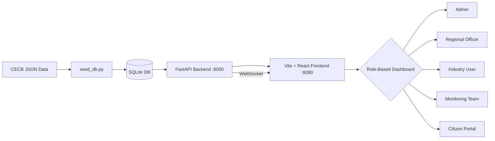

# 🌿 PrithviNet — Environmental Compliance & Monitoring Platform

> Real-time multi-parameter environmental monitoring for Chhattisgarh's industrial regions, built for CECB/CPCB compliance enforcement.

---

## 🚀 Live Deployment

| Environment | URL | Status |
|-------------|-----|--------|
| **Frontend** | https://prithvinet-2e98.vercel.app/ | Live |
| **Backend API** | https://prithvinet-api-prod.onrender.com | Live |
| **API Docs** | https://prithvinet-api-prod.onrender.com/docs | Swagger |

---

## 📋 Quick Start



## Quick Start

```bash
# 1. Install Python dependencies
cd backend
pip install -r requirements.txt

# 2. Seed the database (first run only)
python seed_db.py

# 3. Start backend (port 8000)
uvicorn main:app --reload --port 8000

# 4. In a separate terminal — install & start frontend
cd ..
npm install
npm run dev
```

Frontend: http://localhost:8080 | API Docs: https://prithvinet-api-prod.onrender.com/docs

## Demo Credentials

| Role | Email | Password |
|------|-------|----------|
| Admin | admin@prithvinet.gov.in | Demo@123 |
| Regional Officer | ro.raipur@prithvinet.gov.in | Demo@123 |
| Industry User | compliance@bhilaisteel.com | Demo@123 |
| Citizen | rajiv@example.com | Demo@123 |

## Role Permissions

| Feature | Admin | Regional Officer | Monitoring Team | Industry User | Citizen |
|---------|-------|-----------------|-----------------|---------------|---------|
| View all data | ✅ | ✅ (region) | ✅ (assigned) | ✅ (own) | Public only |
| Submit readings | ✅ | ✅ | ✅ | ✅ | ❌ |
| Manage industries | ✅ | ✅ | ❌ | ❌ | ❌ |
| Resolve alerts | ✅ | ✅ | ❌ | ❌ | ❌ |
| AI Copilot | ✅ | ✅ | ✅ | ✅ | ❌ |

## Tech Stack

| Layer | Technology |
|-------|-----------|
| Frontend | Vite + React + TypeScript + TailwindCSS + shadcn/ui |
| Maps | React-Leaflet with custom cluster/heatmap layers |
| Backend | FastAPI + SQLAlchemy + SQLite |
| Auth | JWT (python-jose) + bcrypt |
| AI | Groq/Llama-3 via OpenAI-compatible API |
| Real-time | WebSocket (native FastAPI) |
| AQI | CPCB National AQI formula (AQI Technical Manual 2014) |

## Data Coverage

Real CECB monitoring data across 5 cities in Chhattisgarh:
- **Raipur** — Air quality (CECB stations)
- **Bhilai-Durg** — Steel plant emissions
- **Korba** — Thermal power + aluminum smelter
- **Raigarh** — Industrial corridor
- **Bilaspur** — Urban air quality

Pollutants monitored: PM2.5, PM10, SO₂, NOₓ, CO, O₃ (air) · BOD, COD, pH, DO (water) · dB levels (noise)
